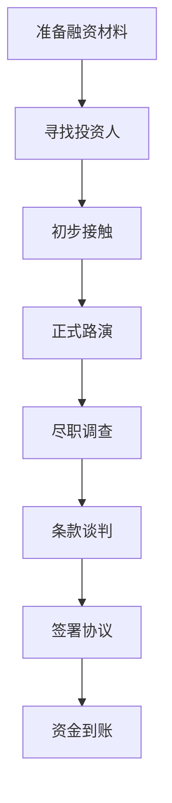

# 2024年创业融资指南：从种子轮到IPO的完整路径

在当前的经济环境下，创业公司的融资变得更加具有挑战性。本指南将为创业者提供全面的融资策略和实用建议。

## 融资环境概览

### 2024年市场特点

今年的融资市场呈现以下特点：

- **投资更加谨慎**：投资人更注重项目的盈利能力
- **估值回归理性**：相比2021-2022年，估值普遍下调
- **行业分化明显**：AI、新能源等热门赛道仍受青睐
- **尽调更加严格**：投资人对财务数据要求更高

### 融资难度指数

| 融资轮次 | 难度指数 | 主要挑战 |
|---------|---------|---------|
| 种子轮 | ⭐⭐⭐ | 产品验证 |
| A轮 | ⭐⭐⭐⭐ | 商业模式验证 |
| B轮 | ⭐⭐⭐⭐⭐ | 规模化能力 |
| C轮及以后 | ⭐⭐⭐⭐ | 盈利能力 |

## 各轮次融资详解

### 种子轮融资

**融资规模**：通常在50万-500万人民币

**投资人类型**：
- 天使投资人
- 早期基金
- 孵化器/加速器

**关键要素**：
```
✅ 强大的创始团队
✅ 清晰的市场需求
✅ 可行的产品原型
✅ 初步的商业模式
```

**准备材料**：
- 商业计划书（10-15页）
- 产品演示
- 团队介绍
- 市场分析

### A轮融资

**融资规模**：500万-3000万人民币

**投资人类型**：
- VC机构
- 产业投资者
- 政府引导基金

**关键指标**：
- 月活用户增长率
- 收入增长曲线
- 用户留存率
- 单位经济模型

**估值方法**：
```python
# 简化的估值计算示例
def calculate_valuation(revenue, growth_rate, industry_multiple):
    """
    基于收入倍数法计算估值
    """
    projected_revenue = revenue * (1 + growth_rate)
    valuation = projected_revenue * industry_multiple
    return valuation

# 示例：月收入100万，年增长率300%，行业倍数10x
valuation = calculate_valuation(
    revenue=100 * 12,  # 年化收入
    growth_rate=3.0,   # 300%增长
    industry_multiple=10
)
```

### B轮及后续轮次

**融资规模**：3000万-2亿人民币

**投资人类型**：
- 知名VC/PE
- 战略投资者
- 主权基金

**关键要求**：
- 清晰的盈利路径
- 规模化运营能力
- 行业领先地位
- 强大的财务数据

## 投资人分析

### 投资人偏好

**技术类投资人关注点**：
- 技术壁垒和专利
- 团队技术背景
- 产品创新性
- 市场应用前景

**财务类投资人关注点**：
- 财务数据真实性
- 盈利模式清晰度
- 现金流状况
- 投资回报预期

### 如何选择投资人

选择投资人时需要考虑：

1. **投资阶段匹配**：确保投资人专注于你的融资阶段
2. **行业经验**：选择有相关行业投资经验的机构
3. **增值服务**：考虑投资人能提供的资源和帮助
4. **投资理念**：确保双方价值观和发展理念一致

## 融资策略

### 融资时机

**最佳融资时机**：
- 业务数据呈现良好增长趋势
- 产品获得市场验证
- 团队相对稳定
- 有明确的资金使用计划

**避免融资的时机**：
- 业务数据下滑期
- 团队动荡期
- 市场环境恶劣期
- 没有清晰的发展规划

### 融资流程



**时间安排**：
- 准备阶段：1-2个月
- 寻找投资人：1-2个月
- 尽调谈判：1-3个月
- 总计：3-7个月

### 估值谈判

**估值影响因素**：

| 因素 | 权重 | 说明 |
|------|------|------|
| 财务表现 | 40% | 收入、利润、增长率 |
| 市场前景 | 25% | 市场规模、竞争格局 |
| 团队能力 | 20% | 创始人背景、团队经验 |
| 技术壁垒 | 15% | 专利、技术难度 |

**谈判技巧**：
- 准备多个估值方法支撑你的估值
- 了解同行业可比公司的估值水平
- 考虑非现金条款的价值
- 保持合理的期望值

## 法律与合规

### 关键法律文件

**投资协议主要条款**：
- 投资金额和股权比例
- 董事会席位安排
- 反稀释条款
- 拖售权和跟售权
- 清算优先权

**注意事项**：
```
⚠️ 仔细审查反稀释条款
⚠️ 理解清算优先权的影响
⚠️ 注意对赌协议的风险
⚠️ 保护创始团队的控制权
```

### 合规要求

**财务合规**：
- 建立规范的财务制度
- 确保财务数据真实准确
- 完善内控制度
- 定期财务审计

**法律合规**：
- 知识产权保护
- 劳动法合规
- 数据安全合规
- 行业特殊合规要求

## 融资后管理

### 投资人关系维护

**定期沟通**：
- 月度/季度业务报告
- 重大事项及时通报
- 定期董事会会议
- 年度股东大会

**报告内容**：
- 财务数据和KPI
- 业务进展和里程碑
- 市场动态和竞争分析
- 团队变化和人才招聘

### 资金使用规划

**资金分配建议**：
- 产品研发：30-40%
- 市场营销：25-35%
- 团队建设：20-30%
- 运营支出：10-15%

**现金流管理**：
- 建立现金流预测模型
- 设置资金预警机制
- 合理控制烧钱速度
- 为下轮融资预留时间

## 常见问题与解决方案

### Q: 如何应对投资人的质疑？

**A: 准备充分的数据支撑**
- 收集详细的市场数据
- 准备竞品分析报告
- 展示用户反馈和案例
- 提供财务预测模型

### Q: 估值过低怎么办？

**A: 多维度证明价值**
- 寻找多个投资人报价
- 强调独特的竞争优势
- 展示未来增长潜力
- 考虑分阶段融资

### Q: 如何平衡股权稀释？

**A: 合理规划股权结构**
- 预留员工期权池
- 考虑可转债等工具
- 设置业绩对赌条款
- 规划长期股权激励

## 行业趋势与展望

### 热门投资领域

**2024年投资热点**：
1. **人工智能**：大模型应用、AI+传统行业
2. **新能源**：储能技术、充电基础设施
3. **生物医药**：创新药、医疗器械
4. **企业服务**：SaaS、数字化转型
5. **消费升级**：新品牌、新渠道

### 未来趋势

**投资趋势预测**：
- 更注重ESG投资理念
- 产业投资者参与度提升
- 跨境投资机会增加
- 政策导向影响加强

## 总结

成功融资需要：

1. **充分准备**：完善的商业计划和财务数据
2. **精准定位**：选择合适的投资人和融资时机
3. **专业执行**：规范的融资流程和法律合规
4. **持续管理**：良好的投资人关系和资金使用

记住，融资只是手段，不是目的。最终目标是建立一个可持续发展的优秀企业。

---

*需要融资咨询服务？联系我们的专业团队获取个性化建议。*
