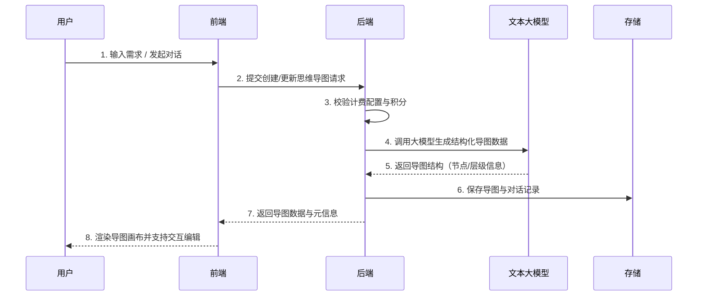

## 界面预览

### 首页入口与快速创建

首页提供多个常用思维导图布局，一键快速创建：

- 空白思维导图
- 向右逻辑思维导图
- 左右结构思维导图
- 向下逻辑思维导图
- 鱼骨图

### AI 创建与编辑画布

在创建页面中，可以通过 AI 对话快速生成结构化导图，也可以拖拽编辑、添加节点、设置颜色等。


### 记录与对话详情

系统会记录每一次思维导图生成与 AI 对话过程，支持在后台查看导图预览、对话详情、积分消耗等信息。


---

## 产品介绍

### 什么是 AI 思维导图插件

**必定AI Mind Map** 是一款集成在 必定AI 平台中的 AI 思维导图工具。  
用户只需要用自然语言描述想法，或在对话中逐步细化需求，系统就能自动生成结构清晰、可编辑的思维导图，帮助你快速整理思路、拆解任务与规划项目。

### 核心价值

| 价值点 | 说明 |
|--------|------|
| 自然语言生成 | 直接用对话方式描述需求，AI 自动生成结构化导图 |
| 多布局支持 | 提供右向、向下、左右、鱼骨图等多种布局，适配不同思考方式 |
| 可视化编辑 | 支持节点增删、内容编辑、颜色调整等操作 |
| 记录沉淀 | 自动保存导图与对话记录，方便复盘与再次编辑 |
| 易于运维 | 后台可配置模型、计费规则、首页文案与对话示例，满足不同业务场景 |

### 适用场景

- 个人效率：周计划、习惯养成、时间管理
- 学习规划：课程知识结构、考试复习提纲
- 产品与项目：功能拆解、Roadmap 规划、需求梳理
- 业务方案：营销活动策划、方案结构设计
- 团队协作：脑暴笔记、会议纪要结构化整理

---

## 功能特性

### 核心功能

| 功能 | 描述 |
|------|------|
| AI 生成思维导图 | 输入自然语言描述或在对话中多轮沟通，由 AI 自动生成导图结构 |
| 多种导图布局 | 支持空白画布、向右逻辑图、左右结构图、向下逻辑图、鱼骨图等 |
| 导图可视化编辑 | 支持添加同级节点、添加子节点、删除节点、撤销 / 重做、居中根节点等 |
| 样式调整 | 支持设置背景颜色、边框颜色、字体颜色，便于区分层级与重点 |
| 导出与下载 | 可将思维导图导出为图片，方便分享与归档 |

### AI 对话能力

| 能力 | 描述 |
|------|------|
| 与导图对话 | 在侧边对话抽屉中与 AI 对话，实时调整或生成新的导图结构 |
| 对话示例 | 可配置多条「试一试」示例问题，帮助用户快速上手 |
| 对话记录 | 后台可查看详细对话内容与消息数量，便于排查问题与优化话术 |

### 管理与配置能力

| 模块 | 描述 |
|------|------|
| 记录管理 | 查看用户生成记录、导图预览、积分消耗等信息，支持批量删除 |
| 模型与密钥配置 | 支持选择不同大模型、配置 API 密钥，并提示如何前往第三方平台开通 |
| 计费配置 | 支持按次数 / 按字数计费，配置每次或每 100 字消耗的积分 |
| 文案与首页装修 | 配置首页展示名称、宣传语、描述等内容，支持富文本与颜色设置 |
| 对话界面配置 | 配置开场白、示例问题、对话框提示文字等，提高新手体验 |

---

## 技术架构

### 技术栈

- 前端框架：Nuxt 3 + Vue 3 + TypeScript
- UI 组件：必定AI UI 组件库
- 状态管理与工具：Pinia + 组合式 API + 内置 hooks
- 后端框架：NestJS
- 数据库：PostgreSQL + TypeORM
- 缓存与任务：Redis（依托主站配置）
- 存储服务：本地文件存储 / 对象存储（按主站配置）

### 核心流程

#### AI 生成思维导图流程



#### 详细步骤说明

1. 用户在首页选择导图布局或打开已有导图。
2. 用户在 AI 对话框输入需求（如「帮我设计一个产品方案的功能清单」）。
3. 前端将请求与当前导图上下文一起发送至后端。
4. 后端根据配置选择对应模型与密钥，按计费策略检查积分是否充足。
5. 调用文心 / Kimi 等大模型服务生成导图结构化数据。
6. 后端将导图数据与对话记录一并存入数据库。
7. 前端根据返回的数据更新思维导图画布，展示最新结构。

---

## 操作手册

### 用户端使用指南

#### 第一步：进入思维导图页面

在导航栏或应用列表中点击「思维导图」进入插件首页。  
首页会展示「快速创建」入口和「最近更新」的导图列表。

#### 第二步：选择导图布局并创建

- 在首页选择一种布局（空白 / 向右 / 左右 / 向下 / 鱼骨图）。
- 点击「创建思维导图」进入编辑页面。
- 为导图命名（可在首页或创建页进行重命名）。

#### 第三步：与 AI 对话生成导图

- 打开右侧「与思维导图对话」抽屉。
- 直接输入需求或选择预置「试一试」示例。
- 等待 AI 回复后，系统会根据对话内容生成或更新导图结构。

对话示例：

```
📅 制定高效率的个人周计划
📄 课程任务进度管理
💡 XXXXXX 产品功能清单
```

#### 第四步：编辑与美化导图

在画布上可以进行如下操作：

- 添加同级节点 / 子节点
- 删除节点
- 撤回 / 还原操作
- 居中根节点
- 调整背景颜色、边框颜色、字体颜色等

#### 第五步：保存与下载

- 导图内容会定期或在关键操作时自动保存。
*- 可将当前导图下载为图片，用于汇报、分享或归档。*
- 在首页「最近更新」中可以快速打开最近编辑过的导图。

### 管理后台配置

管理员可在后台控制台中对思维导图插件进行全局配置和数据管理。

#### 1. 计费与模型配置

路径：`控制台 → 思维导图 → 计费配置`

支持配置：

- 选择大模型（文字大模型供应商）
- 选择对应 API 密钥
- 计费方式：按次数 / 按字数
- 单次消耗积分、每 100 字消耗积分等

#### 2. 对话界面配置

路径：`控制台 → 思维导图 → 对话界面配置`

- 配置开场白文案（例如「👋 Hi，朋友! 告诉我你的想法，我马上能变出一张思维导图~」）。
- 配置「试一试」示例问题列表。
- 配置对话框提示文字（如「提问即创造」）。

#### 3. 首页装修配置

路径：`控制台 → 思维导图 → 首页装修`

- 配置插件前台显示名称。
- 配置宣传语主文案与副标题（支持富文本与多行颜色设置）。
- 实时预览首页展示效果。

#### 4. 记录管理与对话详情

路径：`控制台 → 思维导图 → 生成记录`

- 根据用户 ID、关键词搜索生成记录。
- 查看导图预览图、积分消耗、创建时间等信息。
- 查看某次生成对应的 AI 对话详情。
- 支持单条删除与批量删除。

---

## 积分与计费

思维导图插件支持灵活的积分计费策略（也可以配置为完全免费模式）：

- **按次数计费**：每次生成导图固定消耗一定积分。
- **按字数计费**：根据用户输入内容长度（每 100 字为一个计费单位）进行扣费。
- 支持为不同活动或阶段调整计费规则。

在前台页面会通过「费用说明」模块向用户展示当前计费方式与提示文案，方便用户合理使用积分。

---

## 常见问题

### 问题一：AI 无法生成思维导图怎么办

可能原因与处理建议：

- 网络异常或模型服务不可用：稍后重试或联系管理员。
- 模型或密钥配置错误：请管理员在后台「计费配置」中检查模型与密钥设置。
- 用户积分不足：在个人中心或积分页补充积分后重试。

### 问题二：导图结构不符合预期

优化建议：

- 在对话中明确说明目标与结构层级，例如「请按照三层结构拆解」。
- 分步提问，将复杂需求拆成多个子问题。
- 对 AI 生成结果不满意时，可以通过手动编辑节点进行微调。

### 问题三：导图下载失败

排查步骤：

- 检查当前浏览器网络与存储权限。
- 尝试在不同浏览器或无痕模式下重试。
- 查看后台日志是否有导出失败的错误信息。

### 问题四：如何查看用户的对话详情

管理员可以在后台「生成记录」页面中，点击某条记录的「对话详情」入口，查看完整的 AI 对话内容与消息列表。

---

