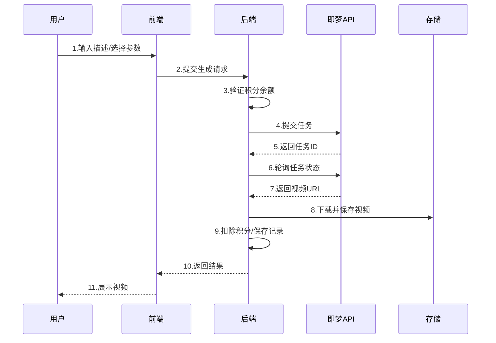

---


## 🖼️ 界面预览

### 灵感广场

浏览精选视频案例，获取创作灵感，一键复用参数快速创作。


### 生成记录

查看历史生成记录，支持重新生成、下载和删除操作。

### 视频播放

视频详情播放界面，支持一键同款和下载功能。


---

## 🎯 产品介绍

### 什么是 AI 视频插件？

**必定AI Video** 是一款集成于 必定AI 平台的 AI 视频生成插件。它利用先进的即梦 AI（火山引擎）技术，让用户无需任何专业视频制作技能，仅通过简单的文字描述或参考图片，即可快速生成高质量的 AI 视频。

### 核心价值

| 价值点 | 说明 |
|--------|------|
| 🎨 **零门槛创作** | 无需学习复杂的视频编辑软件，输入文字即可创作 |
| ⚡ **高效生成** | 5-10秒视频，数秒至数分钟内完成生成 |
| 🎬 **专业品质** | 支持 720P/1080P 高清分辨率，画面流畅自然 |
| 💡 **灵感激发** | 内置灵感广场，提供丰富的创作模板和示例 |
| 💰 **成本可控** | 积分制计费，按需消费，透明定价 |

### 适用场景

- 📱 **短视频创作** - 快速生成抖音、快手等平台的创意短视频
- 🎨 **创意设计** - 为设计方案制作动态展示效果
- 📚 **教育培训** - 制作教学演示视频和动画说明
- 🛒 **电商营销** - 生成产品展示和广告宣传视频
- 🎮 **游戏娱乐** - 创作游戏宣传片和角色动画
- 🌟 **个人创作** - 实现天马行空的创意想法

---

## ✨ 功能特性

### 核心功能

| 功能 | 描述 | 图标 |
|------|------|------|
| **文生视频 (Text-to-Video)** | 输入文字描述，AI 自动生成对应视频内容 | 📝➡️🎬 |
| **图生视频 (Image-to-Video)** | 上传参考图片，AI 基于图片生成动态视频 | 🖼️➡️🎬 |
| **多分辨率支持** | 支持 720P 标清和 1080P 高清两种分辨率 | 📺 |
| **多时长选择** | 支持 5 秒和 10 秒两种视频时长 | ⏱️ |
| **多宽高比** | 支持 21:9、16:9、4:3、1:1、3:4、9:16 等多种比例 | 📐 |
| **种子控制** | 支持设置随机种子，实现可复现的生成结果 | 🎲 |

### 辅助功能

| 功能 | 描述 |
|------|------|
| 🌟 **灵感广场** | 浏览精选视频案例，一键复用参数快速创作 |
| 📜 **历史记录** | 自动保存所有生成记录，支持查看、下载、删除 |
| 🔄 **一键同款** | 在历史记录中复用原有参数重新生成 |
| 🎲 **随机示例** | 一键获取随机提示词，激发创作灵感 |
| 🌐 **多语言支持** | 支持中英文等多语言界面 |

---

## 🛠 技术架构

### 技术栈

- **前端框架**: Nuxt 3 + Vue 3 + TypeScript
- **UI 组件**: 必定AI UI 组件库
- **视频播放**: Plyr.js
- **后端框架**: NestJS
- **数据库**: PostgreSQL + TypeORM
- **AI 引擎**: 火山引擎 (VolcEngine) Visual Intelligence API
- **存储服务**: 本地文件存储 / 对象存储

### 核心流程

#### 视频生成流程图



#### 详细步骤说明

1. **用户输入**: 用户在前端输入视频描述（Prompt）、选择分辨率、时长、宽高比等参数
2. **参数验证**: 前端验证输入参数的完整性和有效性
3. **积分校验**: 后端验证用户积分余额是否足够支付本次生成费用
4. **图片处理**: 如果用户上传了参考图片，后端将其转换为 Base64 格式
5. **API 调用**: 通过 `JimengApiClient` 调用火山引擎 API 提交视频生成任务
6. **任务轮询**: 后端定期轮询任务状态（in_queue → generating → done）
7. **结果处理**: 下载生成的视频文件到本地存储
8. **数据持久化**: 在数据库创建 `VideoRecord` 记录，扣除用户积分
9. **结果返回**: 前端展示生成的视频，支持播放和下载

## 📱 操作手册

### 用户端使用指南

#### 第一步：进入视频生成页面

点击导航栏的「AI 视频」进入视频生成页面。页面分为两个标签页：

- **灵感广场**: 浏览精选视频案例，获取创作灵感
- **我的作品**: 查看个人历史生成记录

#### 第二步：输入视频描述

在输入框中描述你想要生成的视频内容。

**💡 提示词技巧：**

```
✅ 好的提示词示例：
"一只可爱的橘猫在阳光明媚的窗台上慵懒地打盹，
 柔和的光线洒在它金色的毛发上，画面温馨治愈"

❌ 不好的提示词示例：
"猫"
```

**提示词要素建议：**
- 🎯 **主体**: 描述视频的主要对象（人物、动物、物体等）
- 🎨 **风格**: 指定画面风格（写实、动漫、油画等）
- 💡 **光照**: 描述光线效果（阳光、夜景、霓虹等）
- 📷 **视角**: 指定拍摄角度（特写、俯拍、跟随等）
- 🎬 **动作**: 描述运动方式（奔跑、飞翔、旋转等）

#### 第三步：设置生成参数

| 参数 | 选项 | 说明 |
|------|------|------|
| **分辨率** | 720P / 1080P | 1080P 更清晰，但消耗更多积分 |
| **时长** | 5秒 / 10秒 | 10秒视频消耗更多积分 |
| **宽高比** | 21:9 / 16:9 / 4:3 / 1:1 / 3:4 / 9:16 | 根据用途选择合适比例 |
| **参考图片** | 可选上传 | 上传图片可让 AI 基于图片内容生成视频 |
| **随机种子** | 可选设置 | 相同种子可复现相同结果 |

#### 第四步：点击生成

确认参数后，点击「生成视频」按钮。系统将：
1. 检查积分余额
2. 提交生成任务
3. 等待 AI 处理（通常需要 30秒 - 2分钟）
4. 自动显示生成结果

#### 第五步：查看和下载

生成完成后，你可以：
- 🎬 **播放预览**: 点击视频卡片播放
- 💾 **下载视频**: 点击下载按钮保存到本地
- 🔄 **再来一张**: 使用相同参数重新生成
- 🗑️ **删除记录**: 删除不需要的生成记录

### 管理后台配置

管理员可在后台进行以下配置：

#### 1. API 密钥配置

路径：`控制台 → 视频配置 → 密钥配置`

| 配置项 | 说明 |
|--------|------|
| **API URL** | 火山引擎 API 地址（默认：https://visual.volcengineapi.com） |
| **Access Key** | 火山引擎访问密钥 ID |
| **Secret Key** | 火山引擎密钥 |

#### 2. 积分消耗配置

路径：`控制台 → 视频配置 → 计费配置`

| 视频规格 | 默认积分 | 说明 |
|----------|----------|------|
| 720P + 5秒 | 200 | 标清短视频 |
| 720P + 10秒 | 200 | 标清长视频 |
| 1080P + 5秒 | 400 | 高清短视频 |
| 1080P + 10秒 | 400 | 高清长视频 |

#### 3. 灵感管理

路径：`控制台 → 灵感管理`

- **添加灵感**: 上传优秀的视频案例作为灵感展示
- **编辑灵感**: 修改灵感的描述、排序等信息
- **显示控制**: 控制灵感是否在前台展示
- **删除灵感**: 移除不需要的灵感案例

#### 4. 示例配置

路径：`控制台 → 视频配置 → 示例配置`

配置「随机示例」功能使用的提示词库，帮助用户快速获取创作灵感。

---

## 💰 积分体系

### 计费规则

系统采用积分制计费，不同规格的视频消耗不同积分：

| 分辨率 | 时长 | 默认积分 | 说明 |
|--------|------|----------|------|
| 720P   | 5秒  | 200      | 标清短片 |
| 720P   | 10秒 | 200      | 标清长片 |
| 1080P  | 5秒  | 400      | 高清短片 |
| 1080P  | 10秒 | 400      | 高清长片 |


---

## ❓ 常见问题

### Q1: 视频生成失败怎么办？

**可能原因及解决方案：**
- ✅ 检查积分余额是否充足
- ✅ 检查 API 密钥配置是否正确
- ✅ 检查网络连接是否正常
- ✅ 尝试简化提示词重新生成

### Q2: 生成的视频质量不理想？

**优化建议：**
- 📝 使用更详细、具体的提示词描述
- 🖼️ 上传高质量的参考图片
- 🎬 选择 1080P 高清分辨率
- 🔄 多次生成，选择最佳结果

### Q3: 如何获取火山引擎 API 密钥？

1. 访问 [火山引擎控制台](https://console.volcengine.com/)
2. 注册/登录账号
3. 开通「视觉智能」服务
4. 在「密钥管理」中创建 Access Key
5. 将密钥配置到管理后台

### Q4: 支持哪些视频比例？

支持以下 6 种常用比例：
- **21:9** - 电影宽银幕
- **16:9** - 标准横屏（推荐）
- **4:3** - 传统比例
- **1:1** - 正方形
- **3:4** - 竖屏
- **9:16** - 手机竖屏（短视频推荐）

### Q5: 生成的视频可以商用吗？

请参考火山引擎即梦 AI 的服务条款，确保在合规范围内使用生成的内容。

---
