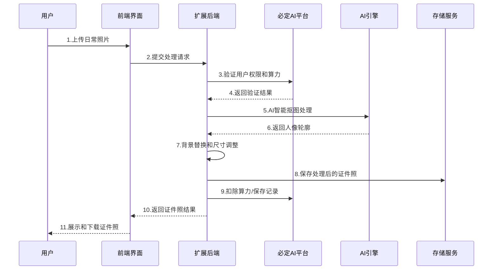

---


## 🖼️ 界面预览

### 证件照生成

简单上传日常照片，智能识别人像并更换背景，一键生成专业证件照。


### 尺寸模板

内置几十种常用证件照尺寸规格，满足签证、考试、简历等各种官方需求。


### 背景更换

支持红色、蓝色、白色、灰色等多种标准证件照背景色。


---

## 🎯 产品介绍

### 什么是 AI证件照插件？

**必定AI ID Photo** 是一款集成于 必定AI 平台的智能证件照生成插件。它利用先进的 AI 人像识别和背景替换技术，让用户只需上传一张日常照片，即可快速生成符合官方标准的专业证件照，无需任何专业摄影或后期处理技能。

### 核心价值

| 价值点 | 说明 |
|--------|------|
| 📸 **专业级质量** | AI智能识别人像轮廓，精准抠图，保证证件照的专业性 |
| ⚡ **极速生成** | 上传照片后数秒内即可完成背景替换和尺寸调整 |
| 🎯 **标准合规** | 内置几十种官方证件照尺寸，确保符合各类场景要求 |
| 💡 **操作简单** | 一键操作，无需学习复杂的图像处理软件 |
| 💰 **成本节约** | 无需专业摄影棚，在家即可制作标准证件照 |

### 适用场景

- 📄 **签证申请** - 各国签证所需的标准证件照
- 🎓 **考试报名** - 公务员、资格证等各类考试证件照
- 💼 **求职简历** - 专业形象的求职照片
- 🏛️ **官方证件** - 身份证、护照等官方证件用照
- 🎫 **会员卡照** - 各类会员卡、工作证所需照片
- 🌟 **日常需求** - 各种需要标准照片的场合

---

## ✨ 功能特性

### 核心功能

| 功能 | 描述 | 图标 |
|------|------|------|
| **智能抠图** | AI自动识别人像轮廓，精准分离人物与背景 | 🤖✂️ |
| **背景替换** | 支持红、蓝、白、灰等多种标准证件照背景色 | 🎨🖼️ |
| **尺寸调整** | 内置几十种常用证件照尺寸模板，一键适配 | 📐📏 |
| **自定义尺寸** | 支持完全自定义宽高比例，满足特殊需求 | ⚙️📋 |
| **高清输出** | 支持高分辨率输出，保证打印质量 | 🖨️✨ |
| **批量处理** | 支持同一张照片生成多种尺寸的证件照 | 🔄📱 |

### 辅助功能

| 功能 | 描述 |
|------|------|
| 📜 **历史记录** | 自动保存所有生成记录，支持查看、下载、删除 |
| 💾 **本地下载** | 支持多种格式下载，方便后续使用 |
| 🔍 **预览放大** | 生成前预览效果，确保满意再下载 |
| 📱 **响应式界面** | 支持手机、平板、电脑等多终端使用 |
| 🌐 **多语言支持** | 支持中英文等多语言界面 |

---

## 🛠 技术架构

### 技术栈

**必定AI 扩展架构:**
- **扩展框架**: 必定AI Extension SDK v25.1.0+
- **前端技术**: Nuxt 3 + Vue 3 + TypeScript
- **UI 组件**: 必定AI UI 组件库 + Nuxt UI
- **图像处理**: Canvas API + AI 背景移除技术
- **后端集成**: 必定AI Core + Service + HTTP 模块
- **数据库**: 必定AI DB (PostgreSQL + TypeORM)
- **用户系统**: 必定AI 统一用户认证和权限管理
- **存储服务**: 必定AI 统一存储服务

**核心依赖:**
- **AI 引擎**: 智能人像识别与背景替换技术
- **算力管理**: 必定AI 算力计费系统
- **多语言**: 必定AI i18n 国际化
- **构建工具**: tsup + concurrently

### 项目结构

```
必定AI-id-photo/
├── src/
│   ├── api/                      # 后端扩展模块
│   │   ├── db/                   # 数据库层
│   │   │   ├── entities/         # 实体定义
│   │   │   │   ├── id-photo-record.entity.ts    # 证件照记录
│   │   │   │   ├── id-photo-config.entity.ts    # 配置管理
│   │   │   │   └── size-template.entity.ts      # 尺寸模板
│   │   │   ├── migrations/       # 数据库迁移
│   │   │   └── seeds/           # 种子数据
│   │   └── modules/             # 业务模块
│   │       ├── web/             # 前端API接口
│   │       ├── console/         # 管理后台接口
│   │       └── example/         # 示例模块
│   └── web/                     # 前端应用
│       ├── components/          # Vue组件
│       │   └── TemplateList.vue # 尺寸模板组件
│       ├── pages/               # 路由页面
│       │   ├── index.vue        # 主页面
│       │   └── console/         # 管理页面
│       ├── services/            # API服务层
│       │   ├── web/id-photo.ts  # 证件照服务
│       │   └── console/         # 管理服务
│       ├── assets/              # 静态资源
│       │   ├── background-*.png # 背景色图片
│       │   ├── example-*.png    # 示例图片
│       │   └── id-photo-demo.gif # 演示动画
│       ├── stores/              # 状态管理
│       ├── i18n/                # 多语言
│       └── models/              # 类型定义
├── manifest.json                # 扩展清单
└── package.json                # 项目配置
```

### 核心流程

#### 证件照生成流程图



#### 详细步骤说明

1. **照片上传**: 用户上传日常照片，系统自动校验格式和尺寸
2. **AI识别**: 智能识别人像轮廓，精准分离人物与背景
3. **背景替换**: 根据用户选择替换为标准证件照背景色
4. **尺寸调整**: 按照选定的尺寸模板调整照片比例和分辨率
5. **质量优化**: 自动优化照片亮度、对比度，确保专业效果
6. **预览确认**: 提供预览功能，用户确认满意后再生成
7. **批量生成**: 支持一次生成多种尺寸规格的证件照
8. **结果保存**: 保存到用户记录，支持随时下载和管理

## 📱 操作手册

### 用户端使用指南

#### 第一步：进入证件照生成页面

在必定AI平台中找到并点击「AI证件照」插件，进入证件照生成页面。

#### 第二步：上传日常照片

点击上传区域，选择一张清晰的日常照片。

**📸 照片要求：**

```
✅ 推荐的照片特征：
- 人像清晰，五官端正
- 光线充足，无阴影遮挡
- 背景简洁，易于识别
- 正面拍摄，表情自然

❌ 避免的照片特征：
- 模糊不清或像素过低
- 侧脸或仰拍俯拍角度
- 戴帽子、口罩等遮挡物
- 复杂背景或多人照片
```

**照片规格建议：**
- 📏 **尺寸**: 建议 800x800 像素以上
- 🎨 **格式**: 支持 JPG、PNG 格式
- 💾 **大小**: 不超过 5MB
- 📐 **比例**: 人脸占照片 1/3 左右
- 💡 **光线**: 光线均匀，避免强烈阴影

#### 第三步：选择证件照规格

从内置模板中选择需要的证件照尺寸，或者自定义尺寸。

| 常用规格 | 尺寸(像素) | 适用场景 |
|---------|------------|----------|
| **1寸照片** | 295×413 | 身份证、学生证等 |
| **2寸照片** | 413×579 | 护照、签证等 |
| **小2寸** | 413×531 | 驾驶证、各类证件 |
| **美国签证** | 600×600 | 美国签证专用 |
| **日本签证** | 450×450 | 日本签证专用 |
| **韩国签证** | 350×450 | 韩国签证专用 |
| **自定义** | 用户定义 | 特殊需求场景 |

#### 第四步：选择背景颜色

选择符合要求的背景色：

| 背景色 | 适用场景 | 色值参考 |
|--------|----------|----------|
| 🔴 **红色** | 身份证、工作证等 | #FF0000 |
| 🔵 **蓝色** | 护照、签证等 | #438EDB |
| ⚪ **白色** | 驾驶证、简历照等 | #FFFFFF |
| ⚫ **灰色** | 各类考试报名等 | #C0C0C0 |

#### 第五步：生成和下载

点击「生成证件照」按钮，系统将自动处理并生成专业证件照。

生成完成后，你可以：
- 🔍 **预览查看**: 确认效果是否满意
- 💾 **下载保存**: 保存到本地设备
- 🔄 **重新生成**: 调整参数重新处理
- 📋 **批量下载**: 一次下载多种尺寸

### 管理后台配置

管理员可在后台进行以下配置：

#### 1. API 密钥配置

路径：`控制台 → 证件照配置 → 密钥配置`

| 配置项 | 说明 |
|--------|------|
| **AI服务地址** | 人像识别和背景处理服务地址 |
| **Access Key** | AI服务访问密钥 |
| **Secret Key** | AI服务密钥 |

#### 2. 算力消耗配置

路径：`控制台 → 证件照配置 → 计费配置`

| 处理类型 | 默认算力 | 说明 |
|----------|----------|------|
| 基础证件照 | 50 | 标准背景替换 |
| 高清证件照 | 100 | 高分辨率处理 |
| 批量处理 | 200 | 多尺寸同时生成 |

#### 3. 尺寸模板管理

路径：`控制台 → 尺寸模板管理`

- **添加模板**: 创建新的证件照尺寸规格
- **编辑模板**: 修改已有模板的参数和名称
- **启用/禁用**: 控制模板是否在前台显示
- **删除模板**: 移除不需要的尺寸规格

#### 4. 背景色配置

路径：`控制台 → 证件照配置 → 背景配置`

配置可选的背景颜色选项和对应的色值，确保生成的证件照符合各类官方标准。

---

## 💰 算力体系

### 计费规则

系统采用算力制计费，不同处理类型消耗不同算力：

| 处理类型 | 默认算力 | 说明 |
|----------|----------|------|
| 基础证件照 | 50 | 标准背景替换和尺寸调整 |
| 高清证件照 | 100 | 高分辨率输出，适合打印 |
| 批量处理 | 200 | 同时生成多种尺寸规格 |
| 自定义尺寸 | 80 | 非标准尺寸的自定义处理 |


---

## ❓ 常见问题

### Q1: 证件照生成失败怎么办？

**可能原因及解决方案：**
- ✅ 检查上传的照片是否清晰、正面拍摄
- ✅ 确认照片格式为 JPG 或 PNG
- ✅ 检查照片大小是否在 5MB 以内
- ✅ 尝试更换背景简洁的照片

### Q2: 生成的证件照质量不理想？

**优化建议：**
- 📸 使用光线充足、清晰的原始照片
- 👤 确保人脸占照片适当比例（约1/3）
- 🖼️ 选择背景简洁的照片进行上传
- 🎯 避免侧脸、仰拍等非正面角度

### Q3: 如何获取 AI 处理服务密钥？

1. 访问相应的 AI 服务提供商控制台
2. 注册/登录账号
3. 开通「人像处理」或「图像识别」服务
4. 在密钥管理中创建 Access Key
5. 将密钥配置到管理后台

### Q4: 支持哪些证件照尺寸？

支持包括但不限于：
- **1寸证件照** - 295×413 像素
- **2寸证件照** - 413×579 像素
- **小2寸** - 413×531 像素
- **美国签证照** - 600×600 像素
- **护照照片** - 390×567 像素
- **自定义尺寸** - 支持完全自定义比例

### Q5: 生成的证件照可以用于官方用途吗？

生成的证件照符合一般官方标准，但建议：
- 仔细核对具体场景的尺寸和背景色要求
- 确保原始照片质量足够高清
- 重要用途建议先咨询相关部门的具体要求

---

