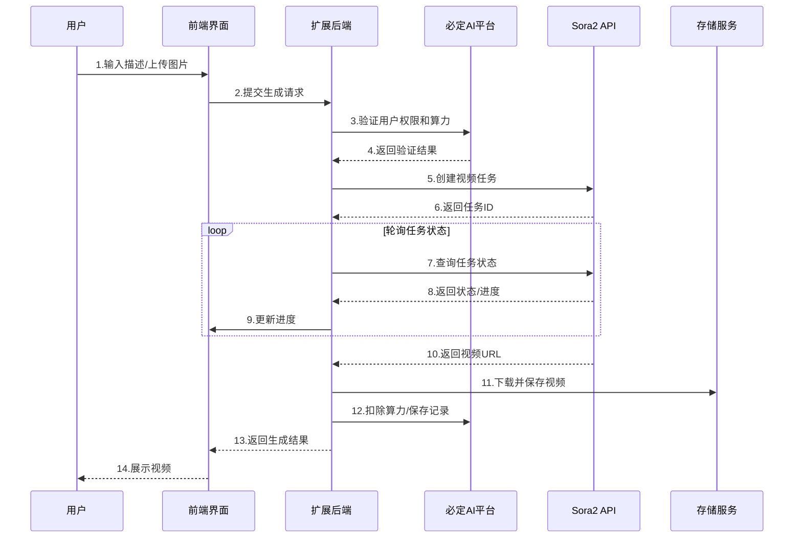

---


---

## 🖼️ 界面预览

### 灵感广场

浏览精选视频案例，获取创作灵感，一键复用参数快速创作。


### 生成记录

查看历史生成记录，支持重新生成、下载和删除操作。


### 视频播放

视频详情播放界面，支持一键同款和下载功能。


---

## 🎯 产品介绍

### 什么是 Sora2 短剧视频插件？

**Sora2短剧视频创作**是一款专为必定AI平台打造的扩展插件。它基于先进的Sora 2.0引擎，专注于短剧和创意视频的智能化生成。插件深度集成必定AI的用户体系、算力管理和存储服务，为用户提供流畅的视频创作体验。

### 核心价值

| 价值点 | 说明 |
|--------|------|
| 🎨 **零门槛创作** | 无需学习复杂的视频编辑软件，输入文字即可创作 |
| ⚡ **高效生成** | 支持多种时长视频，算力优化生成速度 |
| 🎬 **专业品质** | 横竖屏自适应，支持多种预设风格 |
| 💡 **灵感激发** | 内置案例库，提供丰富的创作模板和示例 |
| 💰 **成本可控** | 算力制计费，按需消费，透明定价 |

### 适用场景

- 📱 **短剧创作** - 快速生成短剧片段和创意视频内容
- 🎨 **创意设计** - 为设计方案制作动态展示效果
- 📚 **教育培训** - 制作教学演示视频和动画说明
- 🛒 **电商营销** - 生成产品展示和广告宣传视频
- 🎮 **游戏娱乐** - 创作游戏宣传片和角色动画
- 🌟 **个人创作** - 实现天马行空的创意想法

---

## ✨ 功能特性

### 核心功能

| 功能 | 描述 | 图标 |
|------|------|------|
| **文生视频 (Text-to-Video)** | 输入文字描述，Sora2 自动生成对应视频内容 | 📝➡️🎬 |
| **图生视频 (Image-to-Video)** | 上传参考图片，AI 基于图片生成动态视频 | 🖼️➡️🎬 |
| **横竖屏支持** | 智能识别并支持 portrait（竖屏）和 landscape（横屏）模式 | � |
| **多时长选择** | 支持多种视频时长配置，满足不同创作需求 | ⏱️ |
| **预设风格** | 支持用户自定义预设风格，快速复用创作参数 | 🎨 |
| **模型选择** | 支持 sora-2 和 sora-2-pro 两种模型，满足不同质量需求 | 🚀 |

### 辅助功能

| 功能 | 描述 |
|------|------|
| 🌟 **案例库** | 浏览精选视频案例，获取创作灵感和参考 |
| 📜 **生成记录** | 自动保存所有生成记录，支持查看、下载、删除 |
| 🔄 **任务轮询** | 实时跟踪生成进度，自动更新任务状态 |
| 💾 **本地存储** | 支持视频本地保存，确保数据安全可控 |
| 🌐 **多语言** | 支持中英日多语言界面 |
| 🎛️ **管理配置** | 完整的后台配置管理，支持密钥配置和算力设定 |

---

## 🛠 技术架构

### 技术栈

**必定AI 扩展架构:**
- **扩展框架**: 必定AI Extension SDK v25.1.0+
- **前端技术**: Nuxt 3 + Vue 3 + TypeScript
- **UI 组件**: 必定AI UI 组件库 + Nuxt UI
- **视频组件**: vue-waterfall-plugin-next（瀑布流布局）
- **后端集成**: 必定AI Core + Service + HTTP 模块
- **数据库**: 必定AI DB (PostgreSQL + TypeORM)
- **用户系统**: 必定AI 统一用户认证和权限管理
- **存储服务**: 必定AI 统一存储服务

**核心依赖:**
- **AI 引擎**: Sora 2.0 API 集成
- **算力管理**: 必定AI 算力计费系统
- **多语言**: 必定AI i18n 国际化
- **构建工具**: tsup + concurrently

### 项目结构

```
必定AI-sora2/
├── src/
│   ├── api/                      # 后端扩展模块
│   │   ├── db/                   # 数据库层
│   │   │   ├── entities/         # 实体定义
│   │   │   │   ├── sora-record.entity.ts    # 生成记录
│   │   │   │   ├── sora-config.entity.ts    # 配置管理
│   │   │   │   ├── sora-case.entity.ts      # 案例库
│   │   │   │   └── sora-preset.entity.ts    # 预设管理
│   │   │   ├── migrations/       # 数据库迁移
│   │   │   └── seeds/           # 种子数据
│   │   └── modules/             # 业务模块
│   │       ├── web/             # 前端API接口
│   │       ├── console/         # 管理后台接口
│   │       └── example/         # 示例模块
│   └── web/                     # 前端应用
│       ├── components/          # Vue组件
│       │   └── VideoWaterfall.vue  # 视频瀑布流组件
│       ├── pages/               # 路由页面
│       │   ├── index.vue        # 主页面
│       │   └── console/         # 管理页面
│       ├── services/            # API服务层
│       │   ├── web/generate.ts  # 生成服务
│       │   └── console/         # 管理服务
│       ├── stores/              # 状态管理
│       ├── i18n/                # 多语言
│       └── models/              # 类型定义
├── manifest.json                # 扩展清单
└── package.json                # 项目配置
```

### 核心流程

#### 视频生成流程图



#### 详细步骤说明

1. **用户输入**: 用户输入视频描述（Prompt）、选择时长、方向等参数，可选上传参考图片
2. **前端处理**: 图片压缩处理、参数验证、Base64编码
3. **权限校验**: 通过必定AI平台验证用户权限和算力余额
4. **任务创建**: 调用Sora2 API创建视频生成任务，支持sora-2和sora-2-pro模型
5. **状态轮询**: 定期轮询任务状态（processing → completed/failed），实时更新进度
6. **结果处理**: 下载生成的视频到本地存储（可配置）
7. **数据记录**: 在SoraRecord表中保存生成记录，包含提示词、参数、结果等信息
8. **算力扣除**: 根据配置的算力规则扣除相应算力
9. **结果展示**: 前端瀑布流展示视频，支持播放、下载、删除等操作

## 📱 操作手册

### 用户端使用指南

#### 第一步：进入插件页面

在必定AI平台中找到并点击「Sora2短剧视频创作」插件，进入视频生成页面。页面包含：

- **视频生成区**: 输入提示词和参数设置
- **灵感广场**: 浏览精选视频案例，获取创作灵感
- **我的作品**: 查看个人历史生成记录（瀑布流展示）

#### 第二步：输入视频描述

在文本输入框中描述你想要生成的视频内容。

**💡 提示词技巧：**

```
✅ 好的提示词示例：
"一位年轻女孩在樱花飞舞的公园里慢慢走着，
阳光透过花瓣洒在她的脸上，镜头缓慢跟随，
画面唯美浪漫，短剧风格"

❌ 避免的提示词：
"女孩走路"
```

**提示词要素建议：**
- 🎯 **主体**: 描述视频的主要角色或对象
- 🎨 **场景**: 指定场景环境和氛围
- 💡 **情绪**: 描述想要表达的情感基调
- 📷 **镜头**: 指定拍摄方式（跟拍、固定、推拉等）
- 🎬 **风格**: 指明短剧、电影、纪录片等风格

#### 第三步：配置生成参数

| 参数 | 选项 | 说明 |
|------|------|------|
| **时长** | 多种时长选择 | 根据需求选择合适时长 |
| **方向** | Portrait（竖屏）/ Landscape（横屏） | 系统根据比例自动判断 |
| **模型** | sora-2 / sora-2-pro | pro版质量更高但消耗更多算力 |
| **预设风格** | 自定义预设 | 可保存常用参数组合 |
| **参考图片** | 可选上传 | 支持图片压缩和Base64处理 |

#### 第四步：开始生成

确认参数后，点击「生成视频」按钮。系统将：
1. 验证算力余额
2. 创建生成任务
3. 实时轮询进度（每8秒更新）
4. 自动下载并保存视频（如配置本地存储）

#### 第五步：管理作品

在瀑布流展示的作品区域，你可以：
- 🎬 **预览播放**: 悬停自动播放预览
- 💾 **下载视频**: 保存到本地设备
- � **复用参数**: 一键使用相同参数重新生成
- 🗑️ **删除记录**: 移除不需要的生成记录
- 📊 **查看详情**: 查看算力消耗、生成时间等信息

### 管理后台配置

管理员可在后台进行以下配置：

#### 1. API 密钥配置

路径：`控制台 → 视频配置 → 密钥配置`

| 配置项 | 说明 |
|--------|------|
| **API URL** | Sora 2.0 API 地址（默认：https://api.openai.com/v1） |
| **Access Key** | OpenAI 访问密钥 ID |
| **Secret Key** | OpenAI 密钥 |

#### 2. 积分消耗配置

路径：`控制台 → 视频配置 → 计费配置`

| 视频规格 | 默认积分 | 说明 |
|----------|----------|------|
| 720P + 5秒 | 300 | 标清短视频 |
| 720P + 10秒 | 500 | 标清中视频 |
| 720P + 20秒 | 800 | 标清长视频 |
| 1080P + 5秒 | 600 | 高清短视频 |
| 1080P + 10秒 | 1000 | 高清中视频 |
| 1080P + 20秒 | 1600 | 高清长视频 |
| 4K + 5秒 | 1200 | 超清短视频 |
| 4K + 10秒 | 2000 | 超清中视频 |
| 4K + 20秒 | 3200 | 超清长视频 |

#### 3. 灵感管理

路径：`控制台 → 灵感管理`

- **添加灵感**: 上传优秀的视频案例作为灵感展示
- **编辑灵感**: 修改灵感的描述、排序等信息
- **显示控制**: 控制灵感是否在前台展示
- **删除灵感**: 移除不需要的灵感案例

#### 4. 示例配置

路径：`控制台 → 视频配置 → 示例配置`

配置「随机示例」功能使用的提示词库，帮助用户快速获取创作灵感。

---

## 💰 积分体系

### 计费规则

系统采用积分制计费，不同规格的视频消耗不同积分：

| 分辨率 | 时长 | 默认积分 | 说明 |
|--------|------|----------|------|
| 720P   | 5秒  | 300      | 标清短片 |
| 720P   | 10秒 | 500      | 标清中片 |
| 720P   | 20秒 | 800      | 标清长片 |
| 1080P  | 5秒  | 600      | 高清短片 |
| 1080P  | 10秒 | 1000     | 高清中片 |
| 1080P  | 20秒 | 1600     | 高清长片 |
| 4K     | 5秒  | 1200     | 超清短片 |
| 4K     | 10秒 | 2000     | 超清中片 |
| 4K     | 20秒 | 3200     | 超清长片 |


---

## ❓ 常见问题

### Q1: 视频生成失败怎么办？

**可能原因及解决方案：**
- ✅ 检查积分余额是否充足
- ✅ 检查 API 密钥配置是否正确
- ✅ 检查网络连接是否正常
- ✅ 尝试简化提示词重新生成

### Q2: 生成的视频质量不理想？

**优化建议：**
- 📝 使用更详细、具体的提示词描述
- 🖼️ 上传高质量的参考图片
- 🎬 选择更高分辨率（1080P 或 4K）
- 🔄 多次生成，选择最佳结果

### Q3: 如何获取 Sora 2.0 API 密钥？

1. 访问 [OpenAI 控制台](https://platform.openai.com/)
2. 注册/登录账号
3. 开通「Sora」服务
4. 在「API Keys」中创建 API Key
5. 将密钥配置到管理后台

### Q4: 支持哪些视频比例？

支持以下 6 种常用比例：
- **21:9** - 电影宽银幕
- **16:9** - 标准横屏（推荐）
- **4:3** - 传统比例
- **1:1** - 正方形
- **3:4** - 竖屏
- **9:16** - 手机竖屏（短视频推荐）

### Q5: 生成的视频可以商用吗？

请参考 OpenAI Sora 的服务条款，确保在合规范围内使用生成的内容。

---
